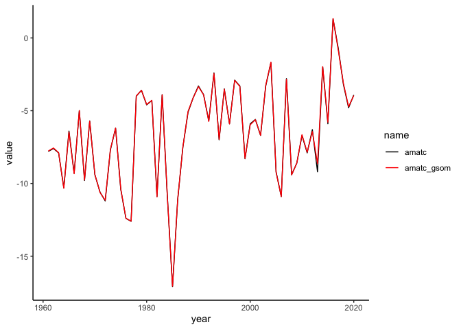

AMATC Differences
================
Bryce Mecum

# Do minor differences in AMATC matter?

For our forecast work, we keep a primary data sheet with all of the
environmental (AMATC, MSSTC, PICE) and run timing (FIFDJ, QDJ, MDJ)
data. This data sheet is updated every year as new data comes in. When I
was handed this project, the data sheet was given to me with no
provenance information and I’ve always wanted to compare what we have in
our main data sheet with what’s available from NOAA.

This notebook answers that question just for AMATC. In the future, we
can look at MSSTC and PICE.

## Strategy

Use the `rnoaa` package to grab “Global Summary of the Month” data from
the NOAA API for the Nome Airport, compare those values with what the
main data sheet has, and then perform a what-if analysis to see how
sensitive the forecast is to any discrepancies.

## Setup

### Packages

``` r
library(rnoaa)
library(readr)
library(dplyr)
```

    ## 
    ## Attaching package: 'dplyr'

    ## The following objects are masked from 'package:stats':
    ## 
    ##     filter, lag

    ## The following objects are masked from 'package:base':
    ## 
    ##     intersect, setdiff, setequal, union

``` r
library(ggplot2)
library(tidyr)
```

### NOAA API Key

``` r
options(noaakey = Sys.getenv("NOAA_KEY"))
```

## Step 1: Get April mean air temps from 1961 to 2021

``` r
get_nome_gsom_april <- function(year) {
  datasets_gsom <- ncdc(datasetid = "GSOM",
                        datatypeid = "TAVG", 
                        stationid = "GHCND:USW00026617",
                        startdate = paste0(year, "-04-01"),
                        enddate = paste0(year, "-04-30"))
  datasets_gsom$data$value
}
```

``` r
result <- lapply(1961:2021, function(y) {
  Sys.sleep(0.1) # Be nice
  data.frame(year = y, amatc_gsom = get_nome_gsom_april(y))
})

gsom_amatc <- do.call(rbind, result)
```

## Step 2: Grab the main data sheet and compare the values

Here I grab the main data sheet from last years’ GitHub repo, bring it
into R and calculate differences between the two series.

``` r
url <- "https://raw.githubusercontent.com/amoeba/2020-yukon-forecasting/master/data/yukon.csv"
yukon_data <- read_csv(url) %>% 
    left_join(gsom_amatc, by = "year") %>% 
    mutate(diff = amatc - amatc_gsom,
           diff_absolute = abs(amatc - amatc_gsom))
```

    ## 
    ## ── Column specification ────────────────────────────────────────────────────────
    ## cols(
    ##   year = col_double(),
    ##   fifdj = col_double(),
    ##   qdj = col_double(),
    ##   mdj = col_double(),
    ##   amatc = col_double(),
    ##   pice = col_double(),
    ##   msstc = col_double()
    ## )

Let’s take a look at a ranked table of the absolute differences.

``` r
yukon_data %>% arrange(desc(diff_absolute))
```

    ## # A tibble: 60 x 10
    ##     year fifdj   qdj   mdj amatc   pice msstc amatc_gsom    diff diff_absolute
    ##    <dbl> <dbl> <dbl> <dbl> <dbl>  <dbl> <dbl>      <dbl>   <dbl>         <dbl>
    ##  1  2013    21    23    28  -9.2  0.7   -3.7       -8.63 -0.570         0.570 
    ##  2  2017    11    13    20  -0.7  0.453 -0.3       -0.83  0.13          0.13  
    ##  3  2012    22    26    32  -6.3  0.753 -3.5       -6.43  0.130         0.130 
    ##  4  2015    17    20    26  -5.9  0.557 -1.7       -5.79 -0.110         0.110 
    ##  5  2018    17    20    23  -3.2  0.13  -0.2       -3.12 -0.0800        0.0800
    ##  6  2019    17    19    23  -4.8  0.078 -0.02      -4.72 -0.0800        0.0800
    ##  7  1965    16    16    19  -6.4 NA      0.6       -6.47  0.0700        0.0700
    ##  8  2000    17    18    25  -5.9  0.555 -1.5       -5.97  0.0700        0.0700
    ##  9  1988     9    12    20  -5.1  0.542  0.7       -5.04 -0.0600        0.0600
    ## 10  2011    15    16    21  -7.9  0.52  -1.5       -7.85 -0.0500        0.0500
    ## # … with 50 more rows

These differences are very small relative to the magnitude of the
values. The worst is just over half a degree C differnce which is a
pretty big difference but the vast majority are &lt;= 0.05C different.
*Note that you’d normally convert to Kelvin to compare temperatures but
we actually don’t care about that because we’re running linear models
here and the absolute differences in the values are all we care about.*

``` r
summary(yukon_data$diff_absolute)
```

    ##    Min. 1st Qu.  Median    Mean 3rd Qu.    Max. 
    ## 0.00000 0.01750 0.03000 0.04333 0.04250 0.57000

### Visualize

I always like to take a look graphically to get a feel for the data so
let’s do that.

``` r
yukon_aironly <- yukon_data %>% 
    select(year, amatc, amatc_gsom)  %>% 
    pivot_longer(-year)
```

``` r
options(repr.plot.width=10, repr.plot.height=4)
ggplot(yukon_aironly) +
    geom_line(aes(year, value, color = name), alpha = 1) +
    scale_colour_manual(values = c("black", "red")) +
    theme_classic()
```

<!-- -->

The table above, plus this graph, makes it look like the differences are
very minor. That’s good. You can see 2013 stick out there pretty
prominently though.

## Does it make a substantial difference to the forecasts?

While it’s useful to see the differences and gratifying to know they’re
small, the most important question is whether the differences *mean*
anything when it comes to the forecasts themselves. Let’s take a look by
running hindcasts (forecasts of previous years) for MDJ (the 50% point).

First we make a function to help us generate forecasts in bulk:

``` r
get_mdj_forecast <- function(data, forecast_years, formula) {
    do_one <- function(forecast_year) {
        data_subset <- subset(data, year %in% seq(min(data$year), forecast_year - 1))
        mod <- lm(formula, data = data_subset)
        floor(predict(mod, yukon_data[which(yukon_data$year == forecast_year),]))
    }
    
    vapply(forecast_years, do_one, 0)
}
```

``` r
(before <- get_mdj_forecast(yukon_data, 1980:2020, mdj ~ amatc + msstc + pice))
```

    ##  [1] 16 16 24 16 23 32 23 19 17 14 15 17 21 17 20 18 17 17 15 24 22 26 18 17 16
    ## [26] 22 23 20 24 23 24 22 26 27 19 23 19 19 17 18 22

``` r
(after <- get_mdj_forecast(yukon_data, 1980:2020, mdj ~ amatc_gsom + msstc + pice))
```

    ##  [1] 16 16 24 16 23 32 23 19 17 14 15 17 21 17 20 18 17 17 15 24 22 26 18 17 16
    ## [26] 22 23 20 24 23 24 22 26 27 19 23 19 19 17 18 22

``` r
after - before
```

    ##  [1] 0 0 0 0 0 0 0 0 0 0 0 0 0 0 0 0 0 0 0 0 0 0 0 0 0 0 0 0 0 0 0 0 0 0 0 0 0 0
    ## [39] 0 0 0

Zeroes across the board. That’s interesting. Good, if it’s true.

## Verify

While I did think that the difference in forecasts would be small, I
still want to check to make sure the above result makes sense. The
forecasted value for MDJ would be expected to change if the differnce in
AMATC values between the main data sheet and the published GSOM values
is great enough *relative to the estimate for the coefficient in the
model*. Let’s look at that for each model to get an idea of the
coefficient estimates.

``` r
current_model <- lm(mdj ~ amatc + msstc + pice, yukon_data)
summary(current_model)
```

    ## 
    ## Call:
    ## lm(formula = mdj ~ amatc + msstc + pice, data = yukon_data)
    ## 
    ## Residuals:
    ##     Min      1Q  Median      3Q     Max 
    ## -8.7985 -1.2049  0.2724  1.6548  6.6906 
    ## 
    ## Coefficients:
    ##             Estimate Std. Error t value Pr(>|t|)    
    ## (Intercept)  18.3832     1.6222  11.332 6.58e-15 ***
    ## amatc        -0.2898     0.1592  -1.820   0.0752 .  
    ## msstc        -1.8931     0.3424  -5.530 1.46e-06 ***
    ## pice          0.6518     3.6458   0.179   0.8589    
    ## ---
    ## Signif. codes:  0 '***' 0.001 '**' 0.01 '*' 0.05 '.' 0.1 ' ' 1
    ## 
    ## Residual standard error: 3.044 on 46 degrees of freedom
    ##   (10 observations deleted due to missingness)
    ## Multiple R-squared:  0.6023, Adjusted R-squared:  0.5763 
    ## F-statistic: 23.22 on 3 and 46 DF,  p-value: 2.671e-09

``` r
gsom_model <- lm(mdj ~ amatc_gsom + msstc + pice, yukon_data)
summary(gsom_model)
```

    ## 
    ## Call:
    ## lm(formula = mdj ~ amatc_gsom + msstc + pice, data = yukon_data)
    ## 
    ## Residuals:
    ##     Min      1Q  Median      3Q     Max 
    ## -8.8101 -1.2075  0.2598  1.6372  6.6756 
    ## 
    ## Coefficients:
    ##             Estimate Std. Error t value Pr(>|t|)    
    ## (Intercept)  18.3951     1.6220  11.341 6.41e-15 ***
    ## amatc_gsom   -0.2925     0.1600  -1.829   0.0739 .  
    ## msstc        -1.8964     0.3421  -5.544 1.39e-06 ***
    ## pice          0.6032     3.6545   0.165   0.8696    
    ## ---
    ## Signif. codes:  0 '***' 0.001 '**' 0.01 '*' 0.05 '.' 0.1 ' ' 1
    ## 
    ## Residual standard error: 3.043 on 46 degrees of freedom
    ##   (10 observations deleted due to missingness)
    ## Multiple R-squared:  0.6025, Adjusted R-squared:  0.5766 
    ## F-statistic: 23.24 on 3 and 46 DF,  p-value: 2.633e-09

This looks like, in either scenario, the coefficient estimate for AMATC
is \~-0.3. That can be interpreted as: For every 1 degree C change in
AMATC, the forecasted value for MDJ would be expected to change by
\~0.3. Since none of our differences between the AMATC values in the
main data sheet and the published NOAA GSOM values was even greater than
0.57, we wouldn’t expect many predictions to change anyway.
